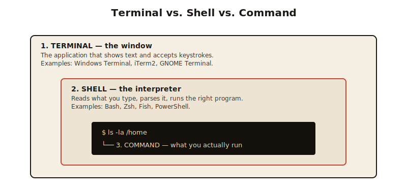
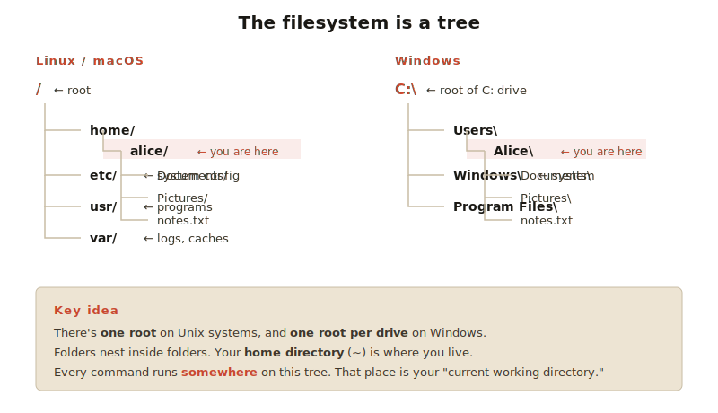
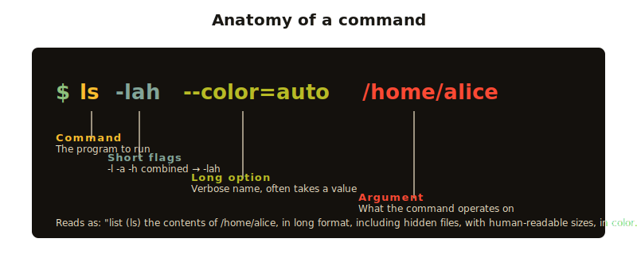

# Module 1 — Foundations

> Before you memorize commands, you need to understand what's actually happening. This module is mostly mental models — and they pay off for the rest of your career.

## In this module

- [1.1 What is a terminal, shell, and command?](#11-what-is-a-terminal-shell-and-command)
- [1.2 The filesystem mental model](#12-the-filesystem-mental-model)
- [1.3 Paths: absolute, relative, and special ones](#13-paths-absolute-relative-and-special-ones)
- [1.4 The anatomy of a command](#14-the-anatomy-of-a-command)
- [1.5 Getting help](#15-getting-help)
- [Exercises](#-exercises)

**Estimated time:** 60 minutes.

---

## 1.1 What is a terminal, shell, and command?

People use these words interchangeably, but they're different things.



- **Terminal** (or "terminal emulator") — the *window* you type into. Windows Terminal, iTerm2, GNOME Terminal. It's just a UI for typing and seeing text.
- **Shell** — the *program* that reads what you type and figures out what to do. Bash, Zsh, PowerShell, Fish — these are shells. They run *inside* a terminal.
- **Command** — what you type. `ls`, `echo`, `git status`. The shell looks it up and runs it.

> 💡 **Analogy**: The terminal is like a phone. The shell is like the language you speak into it. A command is what you say.

Why does this matter? Because when something goes wrong, you need to know *which layer* is broken. If your colors look weird, that's the terminal. If a command isn't found, that's the shell or a missing program.

---

## 1.2 The filesystem mental model

Your computer's files are organized as a **tree**. Every file lives in a folder (called a **directory** in terminal-land). Folders can contain other folders. There is one **root** at the top.



### On Linux & macOS

The root is `/`. Everything is under it.

```
/                       ← root
├── home/
│   └── alice/          ← your home directory
│       ├── Documents/
│       ├── Pictures/
│       └── notes.txt
├── etc/                ← system configuration
├── usr/                ← installed programs
└── var/                ← logs, caches
```

### On Windows

Windows has **multiple roots** — one per drive letter: `C:\`, `D:\`, etc.

```
C:\                     ← root of C: drive
├── Users\
│   └── Alice\          ← your home directory
│       ├── Documents\
│       ├── Pictures\
│       └── notes.txt
├── Windows\            ← system files
└── Program Files\      ← installed programs
```

### The slash difference

- Linux/macOS use **forward slashes** (`/`) to separate directories
- Windows traditionally uses **backslashes** (`\`)
- PowerShell accepts **both** and is forgiving
- In WSL, you're in Linux land — use `/`

### Your "current directory"

At any moment in the terminal, **you are "in" one directory** — your current working directory. When you type a command, it usually operates relative to where you are.

To see where you are:

```bash
pwd                    # Bash/Zsh — "print working directory"
```

```powershell
Get-Location           # PowerShell
pwd                    # also works as an alias
```

---

## 1.3 Paths: absolute, relative, and special ones

A **path** is how you describe the location of a file or folder.

### Absolute paths

Start from the root. Always works, anywhere.

```
/home/alice/Documents/report.txt        ← Linux/macOS
C:\Users\Alice\Documents\report.txt     ← Windows
```

### Relative paths

Start from where you currently are.

If you're in `/home/alice/`, then:

| Relative path        | Means                                |
|----------------------|--------------------------------------|
| `Documents/report.txt` | `/home/alice/Documents/report.txt`  |
| `./report.txt`         | a file `report.txt` right here       |
| `../bob/`              | the directory `bob` next door to you |
| `../../etc/`           | go up two levels, then into `etc`    |

### Special shortcuts

| Symbol | Meaning                                        |
|--------|------------------------------------------------|
| `.`    | the current directory                          |
| `..`   | the directory one level up                     |
| `~`    | your home directory (Bash/Zsh/PowerShell)      |
| `/`    | the root directory (Linux/macOS)               |
| `-`    | the previous directory you were in (with `cd`) |

> 🧠 **Remember**: `..` is the most important shortcut on Earth. You'll use it constantly.

---

## 1.4 The anatomy of a command

Every command you'll ever run follows this shape:



```
command   -flags   --options    arguments
   ↓        ↓          ↓             ↓
  ls       -l        --color    /home/alice
```

- **Command**: the program to run (`ls`)
- **Flags**: short options, usually a dash + single letter (`-l`, `-a`, `-h`)
- **Long options**: usually two dashes + a word (`--help`, `--color`)
- **Arguments**: what the command should operate on (files, paths, text)

### Combining flags

Short flags can usually be **combined**:

```bash
ls -l -a -h        # three separate flags
ls -lah            # same thing, combined
```

### PowerShell is different

PowerShell uses **Verb-Noun** cmdlet names and **named parameters** with single dashes:

```powershell
Get-ChildItem -Path C:\Users -Recurse -Force
```

We'll dive into PowerShell properly in Module 3. For now, know that it has a more structured grammar.

---

## 1.5 Getting help

You will never memorize every command. **Nobody does.** The skill is knowing how to look things up.

### Bash, Zsh, Fish (Linux/macOS)

```bash
man ls          # full manual page (q to quit)
ls --help       # short help (most commands)
tldr ls         # community-written examples (install separately)
```

### PowerShell

```powershell
Get-Help Get-ChildItem               # built-in help
Get-Help Get-ChildItem -Examples     # just the examples
Get-Help Get-ChildItem -Online       # opens docs in browser
```

### When you don't know the command name

```bash
apropos copy           # search for commands related to "copy"
```

```powershell
Get-Command *file*     # find cmdlets matching a pattern
```

---

## 🧪 Exercises

### Exercise 1 — Locate yourself

Open your terminal and run:

```bash
pwd
```

Write down what you see. That's your starting directory.

### Exercise 2 — List the special shortcuts

For each of these, predict what it points to **before running it**:

```bash
ls ~
ls .
ls ..
ls /
```

(On Windows, replace `/` with `C:\` if you're in PowerShell, or use Bash/WSL.)

### Exercise 3 — Read a man page

```bash
man ls
```

Press `q` to quit. Now answer: what flag do you use to show file sizes in **human-readable** form?

### Exercise 4 — PowerShell help

(Windows users — open PowerShell.)

```powershell
Get-Help Get-Process
```

What does `Get-Process` do? What's one example?

### Exercise 5 — Predict the path

You're currently in `/home/alice/Documents/projects/`.

For each relative path, write the absolute path it resolves to:

1. `./report.pdf`
2. `../resume.pdf`
3. `../../music/`
4. `~/Desktop/`
5. `../../../etc/hosts`

→ Check your answers in [solutions.md](solutions.md)

---

## ✅ Module checklist

- [ ] I can explain the difference between terminal, shell, and command
- [ ] I know what `~`, `.`, and `..` mean
- [ ] I can read a path and tell whether it's absolute or relative
- [ ] I know how to look up help for a command
- [ ] I ran `pwd` and saw where I am

---

## ➡️ Next

**[Module 2 — Bash Core](../02-bash-core/)**

Time to actually move around, look at files, and start doing things.
