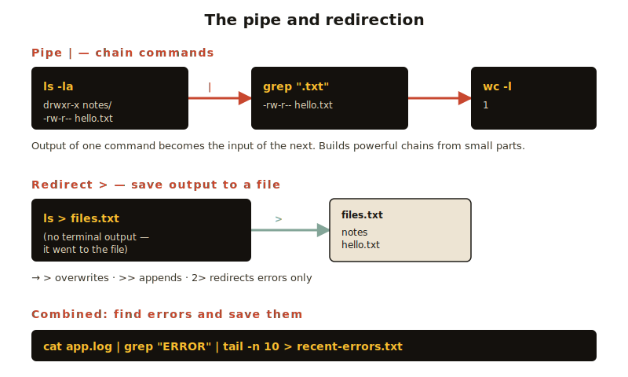

# Module 2 — Bash Core

> The most-used commands you'll learn. By the end of this module, you'll move around, manage files, and combine commands like a pro.

## In this module

- [2.1 Moving around: `pwd`, `cd`, `ls`](#21-moving-around-pwd-cd-ls)
- [2.2 Looking at files: `cat`, `less`, `head`, `tail`](#22-looking-at-files-cat-less-head-tail)
- [2.3 Creating and modifying: `mkdir`, `touch`, `cp`, `mv`, `rm`](#23-creating-and-modifying-mkdir-touch-cp-mv-rm)
- [2.4 Searching: `find`, `grep`](#24-searching-find-and-grep)
- [2.5 The pipe `|` and redirection `>`](#25-the-pipe-and-redirection-)
- [2.6 Permissions and `sudo`](#26-permissions-and-sudo)
- [2.7 Processes: `ps`, `top`, `kill`](#27-processes-ps-top-kill)
- [Exercises](#-exercises)

**Estimated time:** 90 minutes (do the exercises — they matter).

> ⚠️ **Platform note:** All commands in this module work on Linux, macOS, and inside WSL on Windows. If you're using PowerShell or CMD, jump to [Module 3](../03-powershell/) first or use WSL.

---

## 2.1 Moving around: `pwd`, `cd`, `ls`

The three most-used commands in your career. They have short names because you'll type them constantly.

```bash
pwd                  # where am I?
ls                   # what's here?
cd Documents         # go into Documents
cd ..                # go up one level
cd ~                 # go home
cd -                 # go back to where I was
cd /                 # go to root
```

### `ls` with useful flags

```bash
ls                   # plain list
ls -l                # long format — sizes, dates, permissions
ls -a                # show hidden files (start with .)
ls -h                # human-readable sizes (4.2K instead of 4288)
ls -t                # sort by modification time
ls -lah              # all the above, combined
ls /etc              # list a specific directory
ls *.txt             # only .txt files (wildcard)
```

> 💡 **Wildcards (globs)**: `*` matches anything, `?` matches one character, `[abc]` matches any of those letters.

---

## 2.2 Looking at files: `cat`, `less`, `head`, `tail`

```bash
cat file.txt         # dump entire file to screen
less file.txt        # paginated viewer (q to quit, / to search)
head file.txt        # first 10 lines
head -n 5 file.txt   # first 5 lines
tail file.txt        # last 10 lines
tail -n 20 file.txt  # last 20 lines
tail -f log.txt      # follow a file as it grows (great for logs!)
```

### Inside `less`

| Key       | Does what          |
|-----------|--------------------|
| `Space`   | next page          |
| `b`       | previous page      |
| `/word`   | search forward     |
| `?word`   | search backward    |
| `n`       | next match         |
| `g`       | go to top          |
| `G`       | go to bottom       |
| `q`       | quit               |

---

## 2.3 Creating and modifying: `mkdir`, `touch`, `cp`, `mv`, `rm`

```bash
mkdir myproject              # make a directory
mkdir -p a/b/c/d             # make nested directories all at once

touch newfile.txt            # create an empty file (or update its timestamp)

cp file.txt copy.txt         # copy file → copy
cp file.txt backup/          # copy file into backup/ directory
cp -r mydir/ backup/         # copy a directory (need -r for recursive)

mv oldname.txt newname.txt   # rename
mv file.txt ../              # move file up one level

rm file.txt                  # delete a file
rm -r mydir/                 # delete a directory (recursive)
rm -i file.txt               # ask before deleting (safer!)
```

### ⚠️ `rm` is forever

There is **no trash bin** in the terminal. `rm` deletes immediately and permanently.

> 🛡️ **Beginner protection**: add this to your shell config (we'll cover that in Module 7):
> ```bash
> alias rm='rm -i'
> ```
> This makes `rm` always ask you to confirm.

**Never run** `rm -rf /` or `rm -rf ~` — they will obliterate your system or home directory.

---

## 2.4 Searching: `find` and `grep`

### `find` — search for files

```bash
find .                          # everything under current directory
find . -name "*.txt"            # all .txt files
find /home -name "report*"      # files starting with "report" under /home
find . -type d                  # only directories
find . -size +1M                # files bigger than 1MB
find . -mtime -7                # modified in last 7 days
```

### `grep` — search for text inside files

```bash
grep "hello" file.txt           # find lines containing "hello"
grep -i "hello" file.txt        # case-insensitive
grep -r "TODO" .                # search recursively in current dir
grep -n "error" log.txt         # show line numbers
grep -v "debug" log.txt         # invert: show lines NOT matching
```

---

## 2.5 The pipe `|` and redirection `>`

**This is the moment Unix philosophy clicks.** Small programs that do one thing well, chained together.



### The pipe `|`

Take the output of one command and feed it as input to the next.

```bash
ls -la | grep ".txt"                  # list files, then filter to .txt
cat log.txt | grep "error" | wc -l    # count error lines in a log
ps aux | grep firefox                 # find Firefox processes
history | grep "git"                  # find your previous git commands
```

### Redirection: write output to a file

```bash
ls > files.txt          # overwrite files.txt with the listing
ls >> files.txt         # append to files.txt
command 2> errors.log   # send errors (not normal output) to a file
command &> all.log      # send everything to a file
```

### Read from a file with `<`

```bash
sort < unsorted.txt           # feed file as input to sort
wc -l < bigfile.txt           # count lines in bigfile.txt
```

### Realistic combos you'll actually use

```bash
# How many files end in .jpg in this directory tree?
find . -name "*.jpg" | wc -l

# Show the 5 biggest files in this directory
du -h * | sort -h | tail -n 5

# Find every TODO comment in your code
grep -rn "TODO" ./src

# Save a directory listing as a text file
ls -la > directory-listing.txt
```

---

## 2.6 Permissions and `sudo`

Every file on Linux/macOS has three permission groups:

- **Owner** — usually you
- **Group** — a set of users
- **Everyone else**

And three permission types: **read (r)**, **write (w)**, **execute (x)**.

```
-rwxr-xr-- 1 alice users 4096 Jan 12 14:22 script.sh
 ↑│└┬┘└┬┘└┬┘
 │ │  │  └── everyone else: read only
 │ │  └───── group: read & execute
 │ └──────── owner (alice): read, write, execute
 └────────── file type (- = file, d = directory, l = symlink)
```

### Changing permissions

```bash
chmod +x script.sh          # add execute permission
chmod -w file.txt           # remove write permission
chmod 755 script.sh         # numeric: owner=rwx, group=rx, others=rx
chmod 644 file.txt          # owner=rw, group=r, others=r
```

The numeric format: `r=4`, `w=2`, `x=1`. Add them up. `7 = read + write + execute`.

### `sudo` — "super user do"

Some commands need administrator (root) permission:

```bash
sudo apt update             # update package lists (needs root)
sudo nano /etc/hosts        # edit a system file
```

You'll be asked for your password the first time. **Use `sudo` deliberately** — root can do anything, including break your system.

---

## 2.7 Processes: `ps`, `top`, `kill`

Every running program is a **process** with a unique number (PID).

```bash
ps                       # your processes
ps aux                   # everyone's processes (verbose)
ps aux | grep firefox    # find firefox processes
top                      # interactive live view (q to quit)
htop                     # nicer version of top (install separately)
```

### Killing a process

```bash
kill 1234                # ask process 1234 to quit politely
kill -9 1234             # force kill (last resort)
killall firefox          # kill all firefox processes by name
```

### Running in the background

```bash
long-command &           # run it in background
jobs                     # list background jobs
fg                       # bring back to foreground
Ctrl + Z                 # pause foreground job
bg                       # resume paused job in background
```

---

## 🧪 Exercises

### Exercise 1 — Build a small project

```bash
cd ~
mkdir -p terminal-practice/{notes,scripts,data}
cd terminal-practice
touch notes/lesson1.txt notes/lesson2.txt
echo "My first script" > scripts/hello.sh
ls -R
```

What does the structure look like? Predict before running `ls -R`.

### Exercise 2 — Counting with pipes

Create a file with some words:

```bash
echo -e "apple\nbanana\napple\ncherry\nbanana\napple" > fruits.txt
```

Now figure out:

1. How many total lines?
2. How many *unique* fruits? (hint: `sort | uniq | wc -l`)
3. Which fruit appears most often? (hint: `sort | uniq -c | sort -rn`)

### Exercise 3 — Find things

In your home directory:

1. Find all files ending in `.md`
2. Find all directories named `node_modules` (if you have any)
3. Search every `.txt` file in `~` for the word "important"

### Exercise 4 — Permission practice

```bash
echo 'echo "Hello from a script"' > greet.sh
./greet.sh
```

You'll get "Permission denied". Why? Fix it with `chmod`.

### Exercise 5 — The real-world combo

You have a log file with lots of lines. Some contain "ERROR". Write a single command that:

- Reads `app.log`
- Filters to lines containing "ERROR"
- Shows the **last 10** such lines
- Saves the result to `recent-errors.txt`

→ Solutions in [solutions.md](solutions.md)

---

## ✅ Module checklist

- [ ] I can navigate with `cd`, `ls`, `pwd`
- [ ] I can create, copy, move, and (carefully!) delete files
- [ ] I understand what `|` does and have used it
- [ ] I can search with `find` and `grep`
- [ ] I know how to read file permissions
- [ ] I've inspected running processes

---

## ➡️ Next

**[Module 3 — PowerShell](../03-powershell/)**

Now that you know Bash, see how Microsoft did things very differently — and why.
