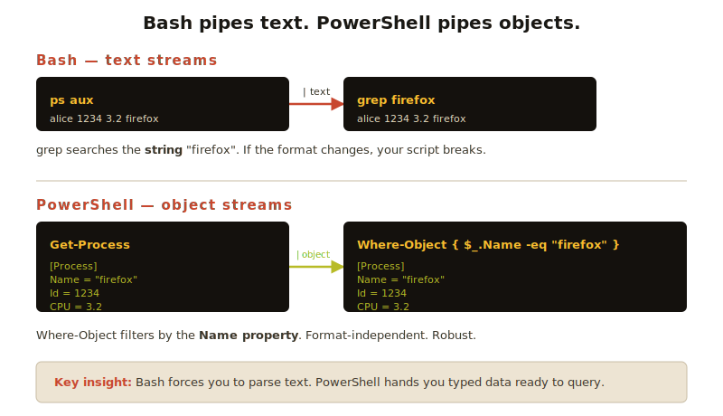

# Module 3 — PowerShell

> Microsoft built something genuinely different. Once you grasp the "objects, not text" idea, PowerShell becomes very fun.

## In this module

- [3.1 Why PowerShell is different](#31-why-powershell-is-different)
- [3.2 Verb-Noun cmdlets](#32-verb-noun-cmdlets)
- [3.3 The pipeline (with objects!)](#33-the-pipeline-with-objects)
- [3.4 `Select-Object`, `Where-Object`, `ForEach-Object`](#34-select-object-where-object-foreach-object)
- [3.5 Aliases — your Bash muscle memory still works](#35-aliases-your-bash-muscle-memory-still-works)
- [3.6 PowerShell vs CMD: a quick CMD survival kit](#36-powershell-vs-cmd-a-quick-cmd-survival-kit)
- [Exercises](#-exercises)

**Estimated time:** 75 minutes.

---

## 3.1 Why PowerShell is different

In Bash, **everything is text**. Commands print text, pipes pass text, the next command parses text. It works, but you spend a lot of time slicing strings.

In PowerShell, **everything is an object**. When you list files, you don't get text — you get `FileInfo` objects with properties like `.Name`, `.Length`, `.LastWriteTime`. You filter and sort by *properties*, not by string position.



This is a big idea. Once you internalize it, you stop reaching for `awk` and `sed` and just write `Where-Object { $_.Length -gt 1MB }`.

---

## 3.2 Verb-Noun cmdlets

Every PowerShell command (a **cmdlet**, pronounced "command-let") follows the same pattern:

```
Verb-Noun
```

Examples:

```powershell
Get-Process            # "get processes"
Stop-Service           # "stop a service"
Get-ChildItem          # "get child items" (i.e., list files)
New-Item               # create something
Remove-Item            # delete
Copy-Item              # copy
Set-Location           # change directory
Get-Help               # built-in docs
```

The verbs are **standardized**. There are about 100 official verbs (`Get`, `Set`, `New`, `Remove`, `Add`, `Find`, `Test`, `Start`, `Stop`, ...) and you'll mostly use a dozen. This means **once you guess a verb, you can usually find what you want**.

> 🧠 **Discoverability trick**: Try `Get-Command *process*` to find every cmdlet with "process" in the name. You'll be amazed how often you guess right.

---

## 3.3 The pipeline (with objects!)

The `|` works in PowerShell too — but it passes **whole objects**, not just text.

### Bash way: filter Firefox processes

```bash
ps aux | grep firefox
```

You're searching the *text* of the output for the substring "firefox".

### PowerShell way

```powershell
Get-Process | Where-Object { $_.Name -eq "firefox" }
```

You're filtering objects by their `Name` property. Cleaner, more reliable, no parsing hacks.

### What's `$_`?

`$_` is the **current object in the pipeline** — the thing being passed in right now. You'll see it constantly.

```powershell
Get-Process | ForEach-Object { Write-Host $_.Name }
```

Reads: "For each process, write its Name."

---

## 3.4 `Select-Object`, `Where-Object`, `ForEach-Object`

These are the three workhorses. Learn them and you can do 80% of what you need.

### `Where-Object` — filter

```powershell
# Processes using more than 100MB of memory
Get-Process | Where-Object { $_.WorkingSet -gt 100MB }

# Files larger than 1 MB in current directory
Get-ChildItem | Where-Object { $_.Length -gt 1MB }

# Files modified in the last 24 hours
Get-ChildItem | Where-Object { $_.LastWriteTime -gt (Get-Date).AddDays(-1) }
```

### `Select-Object` — pick columns and limit results

```powershell
# Only show Name and CPU columns
Get-Process | Select-Object Name, CPU

# Top 5 memory-heaviest processes
Get-Process | Sort-Object WorkingSet -Descending | Select-Object -First 5
```

### `ForEach-Object` — do something per item

```powershell
# Print every .txt filename in uppercase
Get-ChildItem *.txt | ForEach-Object { Write-Host $_.Name.ToUpper() }

# Rename every .txt to .md
Get-ChildItem *.txt | ForEach-Object {
    Rename-Item $_.FullName ($_.BaseName + ".md")
}
```

### Comparison operators (different from Bash!)

PowerShell uses **named operators** instead of symbols:

| Operator | Means                |
|----------|----------------------|
| `-eq`    | equal                |
| `-ne`    | not equal            |
| `-gt`    | greater than         |
| `-lt`    | less than            |
| `-ge`    | greater or equal     |
| `-le`    | less or equal        |
| `-like`  | wildcard match       |
| `-match` | regex match          |

```powershell
Get-Process | Where-Object { $_.Name -like "chrome*" }
```

---

## 3.5 Aliases — your Bash muscle memory still works

PowerShell comes with **built-in aliases** so Bash users feel at home:

| Bash command | PowerShell alias | Real cmdlet      |
|--------------|------------------|------------------|
| `ls`         | `ls`             | `Get-ChildItem`  |
| `cd`         | `cd`             | `Set-Location`   |
| `pwd`        | `pwd`            | `Get-Location`   |
| `cat`        | `cat`            | `Get-Content`    |
| `rm`         | `rm`             | `Remove-Item`    |
| `cp`         | `cp`             | `Copy-Item`      |
| `mv`         | `mv`             | `Move-Item`      |
| `mkdir`      | `mkdir`          | `New-Item -Type Directory` |
| `echo`       | `echo`           | `Write-Output`   |
| `clear`      | `clear`/`cls`    | `Clear-Host`     |

So `ls -la` does work in PowerShell — but for the **real power**, learn the cmdlet names.

> ⚠️ The aliases don't always accept Bash-style flags. `ls -la` works because of compatibility, but `Get-ChildItem` doesn't actually have a `-l` parameter — flags are different.

---

## 3.6 PowerShell vs CMD: a quick CMD survival kit

CMD (Command Prompt) is the older, simpler Windows shell. You'll occasionally need it — recovery consoles, certain scripts, legacy systems.

| Task              | CMD              | PowerShell         | Bash         |
|-------------------|------------------|--------------------|--------------|
| List files        | `dir`            | `Get-ChildItem`    | `ls`         |
| Change directory  | `cd`             | `cd`               | `cd`         |
| Show working dir  | `cd` (no args)   | `pwd`              | `pwd`        |
| Make a folder     | `mkdir`          | `New-Item -Type Directory` | `mkdir` |
| Copy file         | `copy`           | `Copy-Item`        | `cp`         |
| Move/rename       | `move` / `ren`   | `Move-Item`        | `mv`         |
| Delete file       | `del`            | `Remove-Item`      | `rm`         |
| Print to screen   | `echo`           | `Write-Output`     | `echo`       |
| Clear screen      | `cls`            | `Clear-Host` / `cls` | `clear`    |
| Show contents     | `type file.txt`  | `Get-Content`      | `cat`        |
| Help              | `help`           | `Get-Help`         | `man`        |

For 99% of tasks today, **prefer PowerShell over CMD** on Windows.

---

## 🧪 Exercises

### Exercise 1 — Process exploration

```powershell
Get-Process | Sort-Object CPU -Descending | Select-Object -First 5
```

What does this show? Now find:

1. Only processes whose name starts with "s"
2. Top 3 processes by memory (WorkingSet), showing only Name and WorkingSet

### Exercise 2 — File search

In your Documents folder:

```powershell
cd ~\Documents
Get-ChildItem -Recurse -Filter "*.pdf"
```

Now:

1. Find all PDFs *larger than 1 MB*
2. Find PDFs modified in the last 30 days
3. Count how many PDFs you have total

### Exercise 3 — Hands-on object pipeline

```powershell
Get-Service | Where-Object { $_.Status -eq "Running" } | Measure-Object
```

What's the output? What does `Measure-Object` do?

### Exercise 4 — Build a one-liner

Write a single command that:

- Lists every file in your home directory
- Keeps only files (not folders)
- Sorts by size, biggest first
- Shows just the top 10
- Displays only Name and Length

→ Solutions in [solutions.md](solutions.md)

---

## ✅ Module checklist

- [ ] I understand "objects, not text"
- [ ] I can read Verb-Noun cmdlet names and guess what they do
- [ ] I've used `Where-Object`, `Select-Object`, `ForEach-Object`
- [ ] I know about `$_`
- [ ] I know that my Bash `ls`/`cd`/`cat` muscle memory still works

---

## ➡️ Next

**[Module 4 — Other Shells](../04-other-shells/)**

A quick tour of Zsh, Fish, WSL — and how to choose your daily driver.
